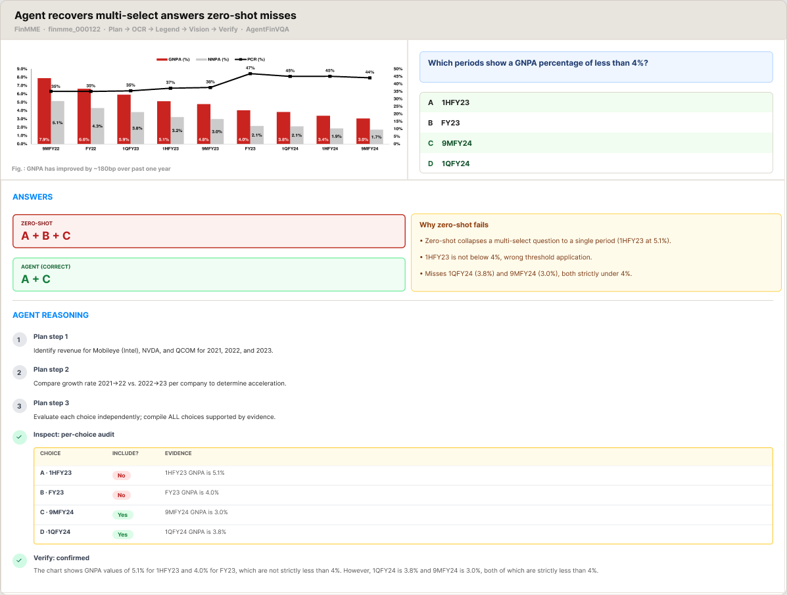
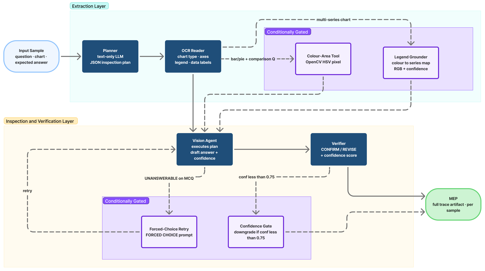

# AgentFinVQA

[](https://github.com/VectorInstitute/AgentFinVQA/actions/workflows/code_checks.yml)
[](https://github.com/VectorInstitute/AgentFinVQA/actions/workflows/unit_tests.yml)
[](https://github.com/VectorInstitute/AgentFinVQA/actions/workflows/docs.yml)
[](https://codecov.io/github/VectorInstitute/AgentFinVQA)


**AgentFinVQA** is a multi-agent framework that helps vision-language models answer questions about financial charts more accurately. Rather than asking a single model to do everything at once, it breaks the task into specialized steps — reading chart text, planning what to look for, answering the question, and verifying the answer — producing measurably better results than a single-pass approach.



## How it works

The pipeline coordinates four specialized agents:

1. **Planner** — reads the question and generates a structured inspection plan (without seeing the image)
2. **OCR Reader** — transcribes all text from the chart image
3. **Vision Agent** — executes the plan using the chart image and extracted text to produce an answer
4. **Verifier** — checks the draft answer and confirms or corrects it

Every run produces a **Model Evaluation Packet (MEP)** — a JSON file capturing the full reasoning trace, which can be used for analysis, debugging, and reproducible comparisons across models.



## Installation

Requires [uv](https://github.com/astral-sh/uv). Install core dependencies:

```bash
uv sync
source .venv/bin/activate
```

To run the agentic pipeline (includes CrewAI, Google GenAI, Streamlit dashboard):

```bash
uv sync --group agentic-xai-eval
source .venv/bin/activate
```

## Configuration

Copy `.env.example` to `.env` and fill in your API keys:

```bash
cp .env.example .env
```

| Variable | Description |
|---|---|
| `GEMINI_API_KEY` | Google Gemini API key (vision backend) |
| `OPENAI_API_KEY` | OpenAI API key (optional planner/verifier backend) |
| `LANGFUSE_PUBLIC_KEY` | Langfuse public key (optional — enables tracing) |
| `LANGFUSE_SECRET_KEY` | Langfuse secret key (optional) |
| `LANGFUSE_HOST` | Langfuse host URL (optional) |

## Quick start

Run the pipeline on a small FinMME slice:

```bash
uv run --env-file .env -m agentfinvqa.runner.run_generate_meps \
    --dataset finmme \
    --split "train[:50]" \
    --config gemini_gemini \
    --workers 4 \
    --out meps/
```

Run the zero-shot baseline for comparison:

```bash
uv run --env-file .env baselines/run_zeroshot.py \
    --dataset finmme \
    --split "train[:50]"
```

Explore results in the dashboard:

```bash
uv run streamlit run src/agentfinvqa/eval/dashboard.py
```

## Project structure

```
src/agentfinvqa/
├── agents/        # PlannerAgent, VisionAgent, VerifierAgent
├── datasets/      # Dataset loaders
├── eval/          # Metrics, evaluation scripts, Streamlit dashboard
├── mep/           # Model Evaluation Packet schema
├── runner/        # End-to-end pipeline runner
└── tools/         # OCR, vision QA, legend grounding tools
```

## Acknowledgements

This work was supported by the Province of Ontario, the Government of Canada through CIFAR, and the Vector Institute.

This project has also received funding from the European Union's Horizon Europe research and innovation programme under grant agreement No. 101214389 ([AIXPERT](https://aixpert-project.eu/)).

## Contact

For questions, collaborations, or contributions, please open an issue in this repository or contact the corresponding author at shaina.raza@vectorinstitute.ai, as listed in the paper.


For questions about the FinMME benchmark, please refer to the [original dataset](https://huggingface.co/datasets/luojunyu/FinMME) by Luo et al.
